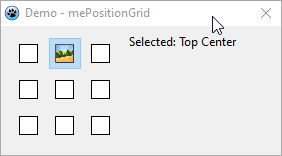

# TmePositionGrid Component for Lazarus

# Демо


## Описание

**TmePositionGrid** - это специализированный компонент для Lazarus, представляющий интерактивную сетку 3×3 кнопок для выбора позиции. Компонент автоматически управляет размерами и состоянием кнопок, предоставляя простой интерфейс для выбора одной из девяти позиций.

## Особенности

- 9 предопределенных позиций выравнивания
- Автоматический расчет размеров
- Настраиваемые иконки для активных/неактивных состояний
- Поддержка подсказок (hints) для каждой позиции
- Фиксированный размер (запрет ручного изменения)
- Визуализация в дизайнере Lazarus

## Использование

### Основные свойства

| Свойство            | Тип           | По умолчанию | Описание                |
|---------------------|---------------|--------------|-------------------------|
| `ButtonSize`        | Integer       | 40           | Размер кнопок в пикселях|
| `Spacing`           | Integer       | 2            | Отступ между кнопками   |
| `StartPosition`     | TGridPosition | gpCenter     | Начальная позиция       |
| `SelectionBitmap`   | TBitmap       | -            | Иконка выбранной кнопки |
| `UnselectionBitmap` | TBitmap       | -            | Иконка обычной кнопки   |

### Пример кода

```pascal
procedure TForm1.FormCreate(Sender: TObject);
begin
  mePositionGrid1 := TmePositionGrid.Create(Self);
  mePositionGrid1.Parent := Panel1;
  mePositionGrid1.Align := alClient;
  mePositionGrid1.ButtonSize := 50;
  mePositionGrid1.Spacing := 4;
  mePositionGrid1.StartPosition := gpTopLeft;
  mePositionGrid1.OnPositionChanged := @PositionChangedHandler;
end;

procedure TForm1.PositionChangedHandler(Sender: TObject);
begin
  case mePositionGrid1.SelectedPosition of
    gpTopLeft: Caption := 'Selected: Top Left';
    gpCenter: Caption := 'Selected: Center';
    // Другие позиции...
  end;
end;
